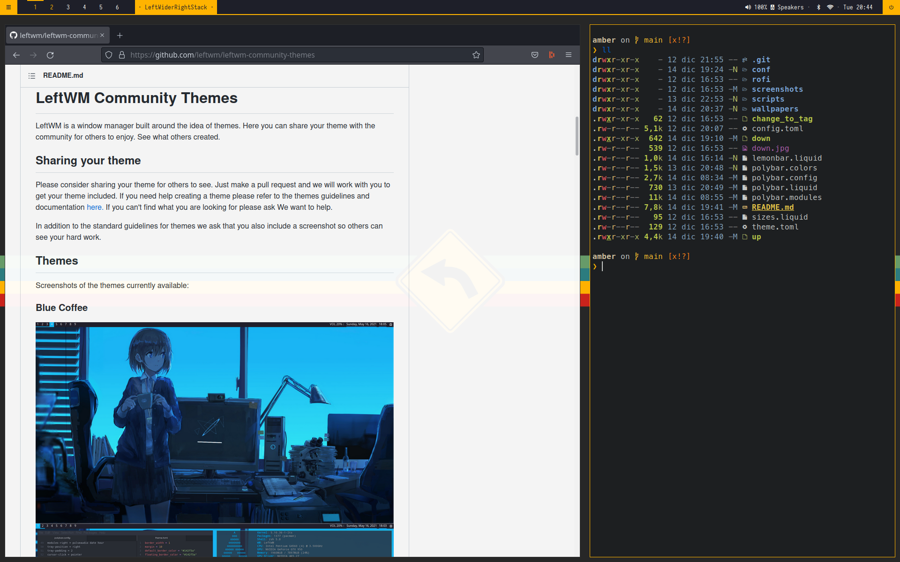
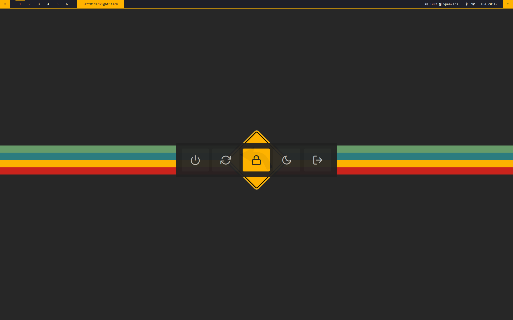
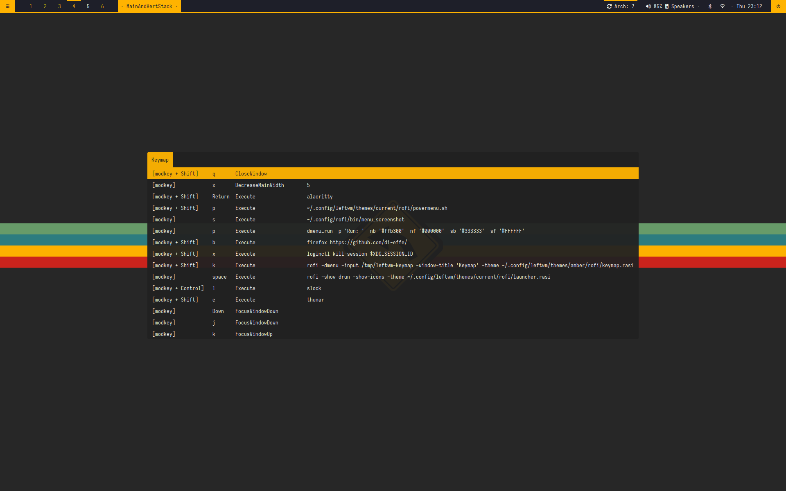

# Amber
*A [leftwm](https://github.com/leftwm/leftwm) minimalistic theme with very few gadgets, widgets and modules*


# Disclaimer
Amber was done in a couple of days without any prior experience on LeftWM theming or tiling window managers in general. It is quite possible there are a few bugs here and there and that things can be improved.

# Screenshots






 


# Changelog

## v0.1.1
- Removed dependency from rofi-themes for applcation launcher

## v0.1
- Dual monitor support
- Amber color scheme
- Powermenu and application launcher (rofi-themes with some small tweaks)
- Picom conf for rounded corners and transparency for inactive windows
- Polybar modules to show and rotate layouts (left click next, right click previous)
- template.liquid config to show and rotate layouts (left click next, right click previous) 
- Keymap


## To do
- Remove dependency on rofi-themes
- A better keymap implementation
- Experimenting with eww 
- Experimenting with lemonbar

# Dependencies

- [leftwm](https://github.com/leftwm/leftwm)
- polybar
- dmenu 
- feh
- [rofi](https://github.com/davatorium/rofi) 
- [picom by ibhagwan](https://github.com/ibhagwan/picom)
- [nerd fonts](https://www.nerdfonts.com/)
- betterlockscreen
- pulseaudio
- pavucontrol
- blueman
- nm-applet
- notify-send

Optionally
- scrot
- viewnior
- lxapperance


# Installation
1. Install all required dependencies

2. Clone the repository

```BASH
git clone https://github.com/di-effe/amber.git
```

3. Make a copy of this project in your themes folder

```BASH
cp -r ./amber ~/.config/leftwm/themes
```

4. Remove the symlink to your current theme if set

```BASH
rm ~/.config/leftwm/themes/current
```
5. Set this as your current theme

```BASH
ln -s ~/.config/leftwm/themes/amber ~/.config/leftwm/themes/current
```

6. Restart your window manager

```Default shortcut
$MOD + Shift + r
```
**!!! IMPORTANT !!!**

Polybar is configured with an application launcher (left side) and a powermenu (right side). Both require **rofi** to be installed on your system, if you want to use them.


# Configuration

## Keymap
At the moment this is a simple and dirty snippet of code placed in the *up* file

```
# KEYMAP

KEYBINDINGS=/tmp/leftwm-keybindings
if [ -f "$KEYBINDINGS" ]; then
    rm $KEYBINDINGS
fi
leftwm-check -v | \
grep Keybind | \
sed -e "s/Keybind: Keybind { command: //g;s/ } true//;s/ } false//" \
> $KEYBINDINGS


KEYMAP=/tmp/leftwm-keymap
if [ -f "$KEYMAP" ]; then
    rm $KEYMAP
fi

sort $KEYBINDINGS | \
tr -d '"' | \
sed -e "s/modifier: //g;s/key: //;s/value: None//;s/value: Some(//;s/)//;s/modkey,/modkey +/" | \
awk -F, '{print $3","$4","$1","$2}' | \
column -s ',' -t \
> $KEYMAP
```

What id does, hopefully, is to retrieve all key bindings to create a keymap to show using rofi.
My config.toml file is configured like this:

```
[[keybind]]
command = "Execute"
value = "rofi -dmenu -input /tmp/leftwm-keymap -window-title 'Keymap' -theme ~/.config/leftwm/themes/amber/rofi/keymap.rasi"
modifier = ["modkey", "Shift"]
key = "k"
```


## dmenu
I am using a custom dmenu color scheme. If you like to use pick it from the config.toml in this repository or configure yours like this:

```
[[keybind]]
command = "Execute"
value = "dmenu_run -p 'Run: ' -nb '#ffb300' -nf '#000000' -sb '#333333' -sf '#FFFFFF'"
modifier = ["modkey"]
key = "p"
```

## Layout module
By default the layout module is configured in the template.layout file
```
%{O20}
%{A1:leftwm-command "NextLayout" :}%{A3:leftwm-command "PreviousLayout" :}
%{F#ffb300}%{F-} [{{ workspace.layout }}]
%{A}%{A}
```
You can chose to 
- remove it, deleting those lines
- keep it aligned to the left, but change the offset in the %{O20} field (those are 20 pixels)
- move it to the center of the screen, replacing %{O20} with %{c}

If you prefer to manage the module in your polybar.config file I left two modules
- layout0, for workspace0
- layout1, for workspace1


## Wallpapers

*up* is configured with the options to
- set random wallpapers from the /wallpapers folder
- set ONE wallpaper for all displays
- set MULTIPLE wallpapers for all displays (default)

Uncomment what you prefer and comment the rest. It should be clear enough reading the file.


# Credit / Sources
Built on top of [basic_polybar](https://github.com/leftwm/leftwm/tree/main/themes/basic_polybar) theme by LeftWM team.

And some inspiration / patches taken from these wonderful sources:

- @AethanFoot [leftwm-theme-dracula-rounded](https://github.com/AethanFoot/leftwm-theme-dracula-rounded) - No license. Author doesn't state permissions on code, will update as neccessary.

- @b4skyx [leftwm-soothe](https://github.com/b4skyx/leftwm-soothe) - No license. Author doesn't state permissions on code, will update as neccessary.

- @VentGrey [Epitaph](https://github.com/VentGrey/Epitaph/) - MIT License copyrighted by Qwart376, author of [Blue Coffee](https://github.com/Qwart376/Blue-Coffee. So I guess this is a russian-doll license thing now.

Wallpapers by [Atlas-ark](https://www.reddit.com/user/atlas-ark/). I am not aware of any kind of licence, but if you can buy him a beer :)

Application launcher is based on the [rofi-themes-collection](https://github.com/lr-tech/rofi-themes-collection) by [LR Tech](https://github.com/lr-tech) covered by a GNU General Public License v3.0

Ping me if I am messing up something here :)
